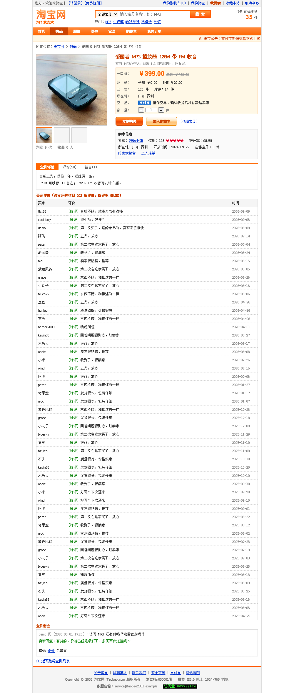

# 回到 2003（retro2003）

**用 2003 年的互联网形态，复刻今天的主流产品。**

如果小红书诞生在 2003 年，它会是什么样？大概是 778px 宽的三栏门户：渐变标题栏、闪烁的 NEW、访客计数器、盖楼留言、论坛和聊天室，还有一个能用数字键操作的 WAP 手机版。如果淘宝还是 2003 年那个刚上线的样子呢？橙色导航、跑马灯公告、表格排版的宝贝列表，卖家是隔壁的网友，货款先放在支付宝手里。

这个仓库就是把这种「假如」做成能真正跑起来的网站：不是截图，不是静态页，是有注册登录、有数据库、有交易和权限、能部署上线的完整站点。

## 在线体验

| 站点 | 地址 | 演示账号 |
| --- | --- | --- |
| 小红书 2003 · 复古门户社区 | https://xhs-2003.dshmod.com | 注册即可；也可以直接逛 |
| 淘宝网 2003 · C2C 网上交易 | https://taobao-2003.dshmod.com | 买家 `demo` / `demo1234`，卖家 `数码小铺` / `demo1234` |

演示站的数据会不定期重置，账号是公开的弱密码，请不要在上面存放任何真实信息。

## 截图

| 小红书 2003 首页 | 小红书 2003 论坛 | WAP 手机版 |
| --- | --- | --- |
|  |  |  |

| 淘宝网 2003 宝贝列表 | 宝贝详情 | 我的淘宝 |
| --- | --- | --- |
|  |  |  |

## 本地跑起来

### 方式一：Docker（一条命令，两个站一起跑）

```bash
git clone https://github.com/Mel0day/retro2003.git
cd retro2003
docker compose up -d --build
# 小红书 2003  → http://localhost:3003
# 淘宝网 2003  → http://localhost:3004
```

首次启动会自动导入演示数据（几十个会员、上百条内容、成百上千条历史评价），打开就是一个「已经运营了两年」的站。停止用 `docker compose down`，加 `-v` 会连数据一起删掉。

### 方式二：Node.js（需要 Node 22+）

```bash
npm run setup                 # 安装两个站点的依赖
npm run dev:xhs               # 小红书 2003 → http://localhost:3003
npm run dev:taobao            # 淘宝网 2003 → http://localhost:3004
```

两个站各自独立，也可以只跑一个：`cd sites/taobao2003 && npm install && DATA_DIR=./data SEED_DEMO=true npm start`。

### 方式三：交给 AI agent

仓库里有给 AI 编程助手看的 [AGENTS.md](AGENTS.md)。把下面这句话连同仓库地址发给 Claude Code、Codex 之类的 agent 就行：

```
把 https://github.com/Mel0day/retro2003 克隆下来，按 AGENTS.md 在本地跑起来，
两个站点都启动后把地址发给我，并告诉我演示账号。
```

## 自己做一个：retro-site 技能包

这个仓库不只是两个成品，还把「怎么做出来的」整理成了一个可复用的技能包 [skills/retro-site](skills/retro-site)：完整工作流程、1999-2005 年的形态参考、视觉与点阵字体规则、演示数据配方、安全与测试清单、部署方案，外加一个脚手架。

**一条命令生成一个能跑的复古站骨架：**

```bash
node skills/retro-site/scripts/new-site.mjs \
  --slug douban2003 --name "豆瓣 2003" --port 3005 \
  --tagline "我读我看我想" --theme "#2e7d32" --width 778
cd sites/douban2003 && npm install && npm test && npm start
```

生成的骨架自带：会员注册登录、内容发布（带图上传）、留言、顶一下、个人空间、站长后台、演示数据、8 项集成测试 + 2 项浏览器测试、Dockerfile、点阵字体。跑起来就是一个 2003 年的站，然后把示例的「内容/留言」换成你要复刻的产品对象即可。

**交给 AI 做：**

```bash
npm run install-skill     # 装到 ~/.claude/skills/retro-site
```

之后在 Claude Code 里说「帮我做一个 2003 版的豆瓣」，它会按这套流程走：问清产品和年代 → 写需求拆解 → 生成骨架 → 实现核心闭环 → 造演示数据 → 跑测试 → 部署。用别的 agent（Codex、Cursor）就把 `skills/retro-site/SKILL.md` 指给它。

## 站点清单

| 状态 | 站点 | 复刻的年代形态 | 主要功能 |
| --- | --- | --- | --- |
| ✅ 已上线 | 小红书 2003 | 2003 年门户社区（网易社区、西祠胡同那一类） | 笔记与 UBB 编辑器、图片上传、盖楼留言与审核、论坛（置顶/精华/投票）、相册、聊天室、购物、积分等级、短消息、排行榜、WAP 2.0 手机版、站长后台 |
| ✅ 已上线 | 淘宝网 2003 | 2003 年 C2C 交易平台 | 宝贝列表与搜索、购物车、支付宝担保交易、我要卖（带图发布）、卖家发货、买家取消、确认收货、双向信用评价（心/钻）、宝贝留言、收藏夹、淘宝小二后台 |
| 🗓 计划中 | 微信 2003 | OICQ 时代的聊天软件网页版 | 好友、群聊、朋友圈、红包 |
| 🗓 计划中 | 百度 / Google 2003 | 极简搜索首页 + 网页快照 | 搜索、贴吧、竞价排名的年代感 |
| 🗓 计划中 | Notion / 飞书 2003 | 企业内网与 BBS 办公 | 文档、表格、审批 |

欢迎按 [docs/新站点开发指南.md](docs/新站点开发指南.md) 提 PR 加新的站点。

## 复刻的规矩

做「复古复刻」最容易变成套个皮，所以这个项目给自己定了几条规矩：

1. **形态要对**：只用当年做得出来的东西。表格排版、内联样式、渐变标题条、跑马灯、闪烁 GIF 式的 NEW、访客计数器、IE 推荐分辨率角标；不用圆角卡片、阴影、大留白，也不用现代前端框架。
2. **字要像**：当年的中文网页是 Windows XP 上没有抗锯齿的 12px 宋体点阵字。仓库里自带了用文泉驿点阵宋体转成的像素网页字体，从 9px 到 16px 每个字号一套，保证今天在 Mac 和手机上看也是当年那种硬边像素感。
3. **功能要真**：每个能点的东西背后都有真实逻辑。能注册、能发帖、能下单、能发货、能评价、能封号；数据落 SQLite，刷新不丢，两个浏览器登录不同账号互不干扰。
4. **数据要像运营了两年**：不是三条示例数据，而是几十个会员、上千条历史评价、按时间散布的订单和帖子，第一屏就有内容密度。
5. **安全不打折**：虽然是复古外观，但 CSRF、转义、参数化 SQL、越权校验、限速、CSP 一样不少，可以直接放到公网上。
6. **不碰法律红线**：站名和界面是致敬，代码全部原创；不使用真实商标图形，不接真实支付，站内资金是演示用的虚拟数字。

## 技术栈

两个站点是各自独立的 Node.js 应用，技术选择刻意保持简单，方便任何人 clone 下来就能跑：

- Node.js 22+ / Express 5 / Nunjucks 服务端渲染，**没有前端构建步骤**
- SQLite（better-sqlite3，WAL 模式），一个进程 + 一个数据目录就是全部依赖
- 原生 JS 做渐进增强，Server-Sent Events 做聊天室和实时推送
- Docker + docker compose 部署，SQLite 在线备份脚本
- Node 内置测试框架 + Playwright：两个站合计 **139 项集成测试 + 14 项浏览器端到端测试**

```
retro2003/
├── sites/
│   ├── xhs2003/         小红书 2003（端口 3003）
│   └── taobao2003/      淘宝网 2003（端口 3004）
├── skills/retro-site/   「怎么复刻一个 2003 版网站」技能包 + 脚手架
├── docs/                项目文档与截图
├── docker-compose.yml   两个站一起跑
└── AGENTS.md            给 AI agent 的部署说明
```

每个站点目录下都有自己的 README（功能清单、路由表、数据模型、演示账号、已知限制）、`docs/需求拆解.md`（产品设计过程）和 `design/`（Claude Design 出的视觉原型）。

## 测试与自检

```bash
npm test                     # 两个站的集成测试
npm run test:e2e             # 两个站的浏览器端到端测试（需要 Chromium）
node sites/taobao2003/scripts/crawl.mjs http://127.0.0.1:3004    # 爬站自检：404/500、模板残留
```

## 部署到自己的服务器

- 最简单：服务器上 `docker compose up -d --build`，前面挂 Nginx（每个站点的 `deploy/nginx.conf` 是现成的示例）。
- 线上这两个站用的是 Cloudflare Worker + Workers VPC + Cloudflare Tunnel，源站不开任何公网端口，做法写在各站点的 `deploy/cloudflare/README.md`（已脱敏成占位符）。
- 备份：`npm run backup` 用 SQLite 在线备份接口生成一致性快照，上传的图片在数据目录里，一起打包即可。

## 许可证与声明

- 代码采用 [MIT 许可证](LICENSE)。
- 点阵字体来自文泉驿点阵宋体（GPL v2 with font embedding exception），演示图片来自 Unsplash，署名与许可见 [NOTICE.md](NOTICE.md)。
- 「小红书」「淘宝」「支付宝」等是各自权利人的注册商标。本项目是对早期互联网形态的怀旧复刻与技术演示，与这些公司没有任何关系，界面与代码均为原创，未使用其商标图形；如需正式对外运营，请改用自己的站名。
- 站内的支付、积分、余额全部是演示用的虚拟数字，不涉及真实资金。
